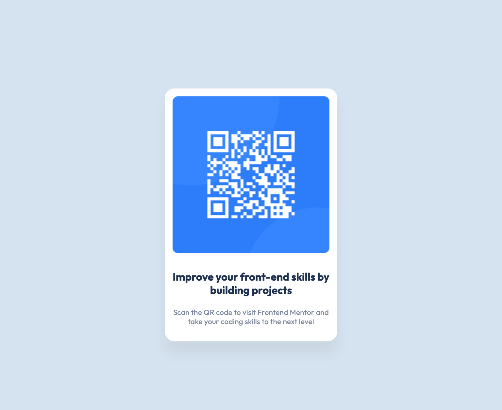

# QR Code Component - Frontend Mentor Challenge

This project is a solution to the QR code component challenge on Frontend Mentor [QR code component challenge on Frontend Mentor](https://www.frontendmentor.io/challenges/qr-code-component-iux_sIO_H).

It's a simple, responsive QR code component designed to enhance my front-end development skills by building a project based on a professional design.


## Table of contents

- [Overview](#overview)
- [Screenshot](#screenshot)
- [Links](#links)
- [My process](#my-process)
- [Built with](#built-with)
- [What I learned](#what-i-learned)
- [Continued development](#continued-development)
- [Useful resources](#useful-resources)
- [Author](#author)
- [Acknowledgments](#acknowledgments)


## Overview

### Screenshot



 

### Links

- Solution URL: [Add solution URL here](https://your-solution-url.com)
- Live Site URL: [Add live site URL here](https://your-live-site-url.com)

## My process

### Built with
- Semantic HTML5 markup
- CSS custom properties
- Flexbox for layout
- Mobile-first workflow


### What I learned

While working on this project, I significantly improved my understanding of responsive design, especially using Flexbox. Here's a CSS snippet that I'm particularly proud of:


```css
.qr-code-component {
  display: flex;
  justify-content: center;
  align-items: center;
  min-height: 100vh;
}


This project also reinforced the importance of mobile-first design and how to effectively use media queries to adapt the layout for larger screens.


### Continued development

I plan to focus on refining my skills in responsive design and start incorporating more complex JavaScript interactions in future projects. Additionally, I'm interested in exploring CSS Grid and modern layout techniques.


### Useful resources
- A Complete Guide to Flexbox (CSS-Tricks) - This article helped me understand how to use Flexbox to create flexible and responsive layouts.
MDN Web Docs - An invaluable resource for understanding HTML, CSS, and JavaScript basics and advanced topics.


## Author

GitHub - https://github.com/Raphaelavazq
Frontend Mentor - @Raphaelavazq


